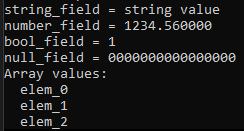

# JSON Library

This is a simple library for parsing and writing JSON files (with pretty formating). Also has nice error messages with line and column.

***This library is fully documented***.

# Table of Contents
- [JSON Library](#json-library)
- [Table of Contents](#table-of-contents)
- [Design](#design)
- [Examples](#examples)
  - [Parsing and reading values](#parsing-and-reading-values)
- [TODO](#todo)

# Design

All JSON values are represented by `std::variant`.

Arrays are a `std::vector` of indexes into values held by the `Structure` object.

Objects are a `std::vector` of structs made of field name and an index into values held in the `Structure` object.

> **Warning**
> Comments are not supported.

# Examples

## Parsing and reading values
```C++
std::string json_txt = R"(
{
    "object": {
        "string_field": "string value",
        "number_field": 1234.56,
        "bool_field": true,
        "null_field": null
    },
    "array": [
        "elem_0",
        "elem_1",
        "elem_2"
    ]
})";

json::Structure structure;
if (structure.parse(json_txt) == false) {
    for (auto& error : structure.errors) {
        printf("line = %d column = %d %s \n",
            error.line, error.column,
            error.msg.c_str()
        );
    }

    throw std::exception("parsing error occurred");
}

json::Value& root_val = structure.getRoot();
json::Object& root = json::getObject(root_val);

json::Value& object_val = structure.getValue(root, "object");
json::Object& object = json::getObject(object_val);
{
    auto& v = structure.getValue(object, "string_field");
    printf("string_field = %s \n", json::getString(v).c_str());

    auto& v1 = structure.getValue(object, "number_field");
    printf("number_field = %f \n", json::getNumber(v1));

    auto& v2 = structure.getValue(object, "bool_field");
    printf("bool_field = %d \n", json::getBool(v2));

    auto& v3 = structure.getValue(object, "null_field");
    printf("null_field = %p \n", (void*)json::getNull(v3));
}

json::Value& array_val = structure.getValue(root, "array");
json::Array& arr = json::getArray(array_val);

printf("Array values: \n");
for (auto& value_index : arr) {
    json::Value& value = structure[value_index];
    printf("  %s \n", json::getString(value).c_str());
}
```



Begin by calling `json::Structure::parse` to parse the `std::string`, the function will return `false` if any errors are encountered. You can then read the `errors` field to find out the problem.

Call `json::Structure::getRoot` the the value of the top most value or `json::Structure[0]`.

To convert from `json::Value` to C++ type you can use the helpers `json::getNumber`, `json::getBool`, `json::getString` etc.

To read the items of JSON arrays and fields of JSON objects use `json::Structure::getValue`.

You can read the `Structure` values directly using `json::Structure::operator[]`.

# TODO

- Add Error messages example
- Add Write example
- Add path style access Example `lookup(["field_name", 1, "sub_field_name", 14])`
- Add comments